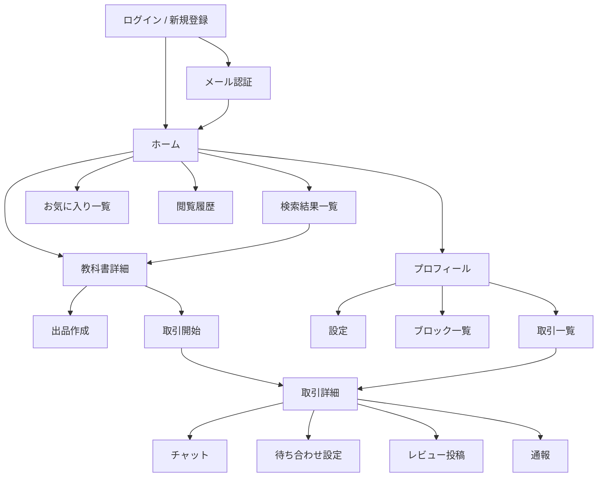

# Campus Trade 画面一覧・遷移図

## 目的

Campus Trade の主要画面を整理し、React 実装前にページ構成と遷移を固定するための設計メモ。

## 画面一覧

### 1. 認証系

- ログイン画面
- 新規登録画面
- メール認証画面
- 再認証画面
- パスワード再設定画面

### 2. メイン系

- ホーム画面
- 検索結果一覧画面
- 教科書詳細画面
- 出品作成画面
- 出品編集画面
- お気に入り一覧画面
- 閲覧履歴画面
- プロフィール画面
- 設定画面

### 3. 取引系

- 取引一覧画面
- 取引詳細画面
- チャット画面
- 待ち合わせ設定画面
- レビュー投稿画面
- 通報画面
- ブロック一覧画面

### 4. 管理・補助系

- 学部一覧表示
- 安全スポット一覧表示
- エラーページ
- 404 ページ

## 画面の役割

### ログイン画面

- メールアドレスとパスワードでログインする
- `@keio.jp` 以外は登録段階で弾く
- 長期未ログインなら再認証へ誘導する

### 新規登録画面

- 名前、メール、パスワード、学部を入力する
- 登録後に確認メールを送る

### ホーム画面

- 商品カードを一覧表示する
- デフォルトでは状態・新しさ・評価・同学部優遇で並べる
- 検索、並び替え、お気に入り導線を置く

### 教科書詳細画面

- 商品情報、画像、出品者情報、公開コメントを表示する
- 購入者は「連絡する」ボタンから取引を開始する
- オークションは入札もここから行う

### 出品作成画面

- 固定価格かオークションかを選ぶ
- 状態、学部、講義名、教授名、ISBN、画像を入力する
- 投稿後は詳細画面へ遷移する

### 取引詳細画面

- 取引状況を時系列で確認する
- チャット、待ち合わせ場所、お釣りなし合意、完了操作をまとめる
- レビュー投稿にも遷移する

### 設定画面

- 言語、テーマ、プロフィール、パスワードを設定する
- ブロック管理や通知設定を置く余地がある

## 遷移図

## MVP の画面優先順位

### Phase 1

- ログイン画面
- 新規登録画面
- メール認証画面
- ホーム画面
- 検索結果一覧画面
- 教科書詳細画面
- 出品作成画面
- 取引一覧画面
- 取引詳細画面
- チャット画面

### Phase 2 以降

- お気に入り一覧画面
- 閲覧履歴画面
- 待ち合わせ設定画面
- レビュー投稿画面
- 設定画面
- 通報画面
- ブロック一覧画面

## 実装メモ

- ホームはカード型 UI にする
- 詳細画面は商品情報、公開コメント、取引導線を分ける
- 取引詳細はモバイルで下部タブ構成にすると使いやすい
- 認証済みかどうかでヘッダーの出し分けを行う
- 再認証が必要な場合は強制的に再ログイン画面へ飛ばす
